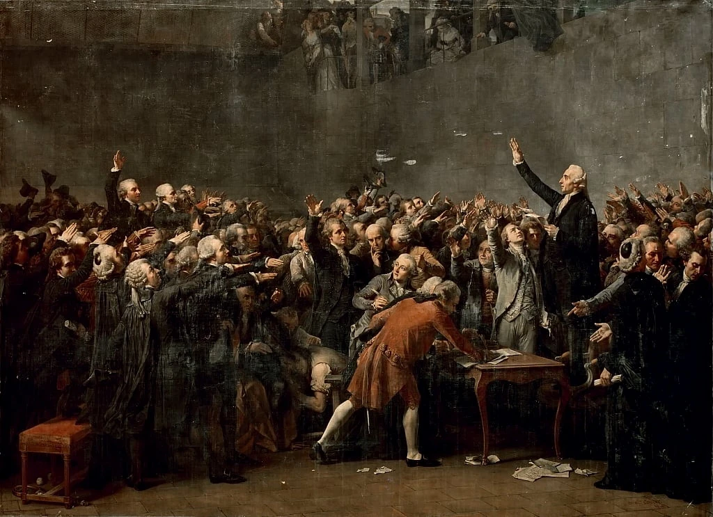

## Antes que nada, un poco de contexto

Para empezar, no está de más señalar que la forma en la que hoy concebimos al **Estado**(1) no ha sido siempre la misma. A lo largo de la historia las sociedades concibieron distintas formas de organizarse. Nuestra idea de Estado deviene de todo un desarrollo histórico y del pensamiento que rastrea sus orígenes hacia la Grecia de la antigüedad. La existencia de los estados es quizás anterior a la teoría política, y no fue hasta la aparición de Platón que nuestra civilización -la civilización occidental- se preguntó cosas como: "¿qué es un Estado?", o bien "¿cómo debería ser el Estado ideal?" (_guardando esta última pregunta una íntima relación con la idea de justicia_).

Existen varios filósofos que abordaron estas cuestiones durante el período de la antigüedad, pero Platón fue quizás el primero en formular una teoría sobre el Estado ideal, teoría que obviamente no estaría excenta de sus propias reflexiones sobre la virtud, la belleza y la justicia. Posteriormente, sería Aristóteles quien profundizaría aun más en estas cuestiones, enfocándose en la idea del ciudadano como unidad atómica de la sociedad política, la relación de la condición de ciudadanía con la idea de la libertad, y el propósito del mismo Estado como tal.

No sería sino hasta la modernidad que surgirían nuevas teorías del Estado, las cuales tendrían como objeto principal **fundamentar la legitimidad del Estado**, mas que preguntarse por la forma de un Estado ideal. El declive de los señoríos feudales y la transferencia del poder a la figura del monarca, sumados a la inestabilidad social y religiosa que tuvieron lugar durante época Moderna conducirían a unos y otros pensadores por diferentes caminos. La mayor parte de estos pensadores intentaría lograr una cohesión entre el Estado y la sociedad, basándose en ideas como el **derecho natural**(2) y la necesidad de un poder centralizado en la figura del Estado.

Es en este período histórico donde decidiré detenerme a examinar y exponer las distintas posturas y formas en las que se intentó formular aquello que, a partir de la modernidad y durante otros siglos en adelante, entenderíamos como estados-nación -al menos hasta el período de la Gran Guerra y antes del fenómeno de la globalización-. Todos estos pensadores serían los precursores que sentaron las bases de la política contemporánea y sus diferentes vertientes, así como también los fundamentos de ideas tan familiares como **la propiedad privada** o **el colectivismo**.