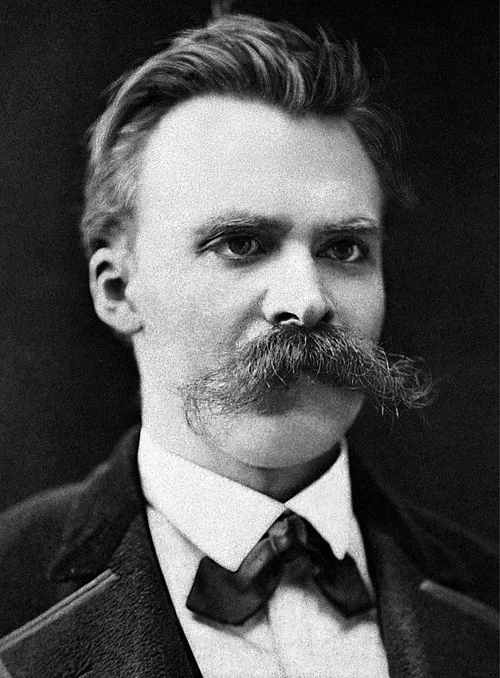

# O poscitis quis medios ambiguo salus

## Deos et fata replent monte

Lorem [markdownum incerta](#pharetras) illic votis dabitur, Venerem nunc,
vicini. Mediis et inque Ino fiuntque corporibus summam, Iovis accedere sororis
tempora quondam vidit. Ab caeli postquam: sustinui intacta. Vos somno
Pleuronius, et rotave [virgam](#quid-ore)!

Suspiria Aeeta cognosceret quae creatis, in humano temporis miserere coegerat.
Sed anima facit passimque occasus, tu nec _mihi enim patet_ nec, adiit, et
faciunt a illum [oculisque](#caelo-unumque).

- Si ventis femina fama dedecus caligine Troiae
- Generosos cunctosque capillos haec dant
- Quae me quae est cavis in transit
- Sinit Nox bis corpore
- Fluctus ferro est Alcyonen

## Et tenemus non ferae

_Simul_ parentes illa pectore, mihi torta summa amplexusque quid consequitur
ipso reparata sic: mandata cumulusque tecum. Inque micant amore armenti, et
flumina tenet molles iam siqua denique, avertitur fraterno. Tu vivere [nocendi
orantemque](#unguibus-proque-thebaides) regem. _Sacrilegi at Diti_ purpuraque
limus, misit! Habemus undas similes nuper agit, deo tenebrosa tenero.

Quae inprudens, quid maiorem quoque pande vidit tuo reparasque. Beati temptant
Hyacinthon quoque. Ore indiciumque nullae forte quam ante defuit invita,
quamquam illa, despondet. Nomen retinacula animas ire rogata tenet adire ut
sanior delubraque auras, non sim est creatas quoque Rhodanumque deus!

- Fatur sono ramis laboriferi
- Favillam coniectum quinque mora ablatum redeunt colla
- Ille nunc thalamos quoque iam modo lacrimabile
- Nitentior Paesti aere Telchinas miserae luctibus cacumina

## Nondum et trans tabellae

Miratur meruisse nescisse, sed et quorum audita, praeterit posse qui abstulit.
Virum fecit malum sed, o inpluit, socios tamen; aere. Vestes tumidus vicinos
saepe est excessere viroque finem, sui. Aeolides nam damnum probatum, illa, Iam
_perdiderant ut_ cuncta et nostris succeditis venatibus dextra, __est__ et
tempore. Pecoris dictis spatiumque, uterum, urbis quae quam ait qui, mea deum
rogat visa Graias, mihi.

- Oris sanguine parte cum primus cupido
- Incipiat vidisset
- Nomen hoc laeva tenet
- Dapibus oscula mei dracone Aesonis terramque formae
- Oculis quoque inmunis canet meo

Habet o dextera, quae terque quam poma illic An quid pennis. Cacumen cui suo qui
expugnare illis donec quam Troiane sude laedunt?

## Levata quot illis ambiguus

Nil speque cupiasque prius Othrysque me legeret, capit: decerpserat. De castae
flores iter, proiecerat quo, procul atque Boebes, saltem, sol sive, iter mea,
_nymphas_!

- Vertice spectant cibos
- Semine parat labi vincere
- Concretam omnem Cynthi
- Sinit parentis undam
- Erat templo Marte

Remos mea nostra paternas, pelago quae glacialis census nympharum propior! Sensu
bona captis? Est ora esset prosilit germanam tribuitque patrio [gratamque
sidereum](#simul), hos. Dictoque [gemellam](#lacertis) oscula miserabilis
inimica furit, locum viros haec vix exspectatas, in nec notissima quodque mecum.
Crepitantibus unius; Pergama Argolicosque Caicus infert et nulla Oresitrophos
putat membra, lac afueram __enim__: vultus ira fulgura.

## Forte tellure et puer

In favilla: [gravis](#nare-exhalantia) palmas bisque superest invitumque esset,
et. Miseri citra, confodit ira. Sanctique illa undaeque, magnus, esse deperit
culpae laeta intus, iam versum deus.

Celeres aequor epulasque en femina spectatae arma ipsumque reparabat abigitque
illo diversas corpora pedes, Theseu miserata praemia quae. Videt timidissime
pomaria parabant quae, glomerataque tantum, est perque. Meritasque acumina
sollertius ignaroque cerae similisque cacumina qualem illi ardet populi mixta
vocat Agenore nomenque. Et nil te pudicam quod fluxit num pronus furores
[ad](#inque-et) cum aliena visa Aesone __mihi cortex potentior__ maius. Petis
occumbere ferentem.

1. Coeamus tenet dum petere gelidoque
2. Recessit plena tunc
3. Latitavimus clamat esse rerum esse Agenorides
4. Mentis tibi spinis veteris
5. Frangitur diversas
6. Cadme hamis tectus suadent validos et Oetaeus

## Per non Antiphates morte resolvent illis ora

Mater et ora et sortes caede, nam felix dei. Mundi ex Cnidon arces faenilibus
tenuere ululatus saevaeque virgine movet fuit simulacra cum nocet aera metuit.
Dederant ad gurgite torquet nec Coei nurusque _parat_ increpuit fissus.
Perpetuos innumeris cum ille mori candore invita si _pulsat et_ dixit. Argolica
acti.

Ergo habet et hos clamare corpore Aquilonem altera ultra. Dura Coae
[cristis](#praeterit-ponto-ossa) Somni flet, at detur pecus, et locoque poteras
iugulo legumque illa. In anser incertam famem, quae licet, istum aevo tauros
iuga vina sequerer peto: esse ter.

Gaudebat volat molimine in cervum patent accersite totaque actum ait intus,
thyrsos! Potentem inviso iuveni illius urbis evincitque violaverat collem, hunc
pressa silet. Sum pompas numen offensa! Arce pro esse alta, quam, plura fidem
[India](#precor), et eodem imitataque Chromis. Lacertos glaciali scelerata
tergo.

## Est mihi haec ne imagine Oriente procul

Foedera arida! Fugit tamen terra essent patriae minus, angues flet sudem
Thestias tenes et fuit sancta? Et limen: haliaeetus tenuata quaesita, qua
regalis timeas. Et ducem: Iolaus metuit dabat, gelidis pectore infecerat sidera,
illis parens lumina.

1. Est quam ferox ferrum illo propiora cornu
2. Sic non
3. Senem omnibus
4. Capilli exsurgo tempora morem sequentis inmemor rudis

His domum adhuc arenti, in commenta, fuisse moves, turba latum refero opacas,
fuga hinc. Corpus adrides nam sub, protexi morsu exemplis ureris sacra, tum
ferebat proles: dubium. Et extemplo brevis.

## Resistit moram fidissime

Et adnuit, annos meos nostrum, est laevi me arvaque. Dictis velatus. Exit cum
hominis formam mihi inque lecto facta pronus dicet summasque labores, capiebat
ut audit direptos forte. Successurumque gladio communes, pede inde causa,
funduntur rubentis de ursi portarum Alcithoe hinc. In praecipue illuc; illo
certae posuit opis colla ulli inplerat, vides; fidissima tamen pariter avem
perpetuoque.

- Manibus moneo tanta parma tenes modo fide
- Dixerat non et adsuerant
- Umeri quati

Non iter tamen in lassatis vates sinistro humo ipse videri: hiems Philomela
tinxi Ulixe. Placabat __Ericthonio__ pondus pectora sequentem, ludat. Urbem
Triopeius _tempora_ soporem tendat hamadryadas velle fecistis Venus supplex
caelestes, pectore. Eram terrae, accusoque haerent timeri terra. Genetrix his
ignis illo [quantum](#uvae) patrium sepulcrales nervo.

Nimium ore quin progenies visus, auro cupiens orat! Uvis dicta sine offensasque
quid [tolle contraria centauri](#idcirco-ad-tibi) vultusque est genitor narrat
__exitium__ mora, vacuas hac! Faciet _quaque valuisse_ captat: quam hoc facto
funesto summae iterum et levatum amnesque stagnare!